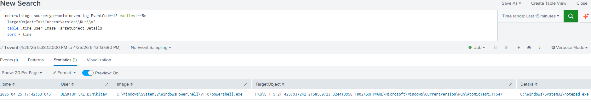

# Detection Case Study: Registry Run Key Persistence

**Date:** April 25, 2026  
**Analyst:** Mitchel Kitavi  
**Environment:** Windows 10/11 endpoint with Sysmon + Splunk Enterprise SIEM  
**Status:** Detection validated ✅

---

## MITRE ATT&CK Mapping

| Field | Value |
|---|---|
| Tactic | TA0003 — Persistence |
| Technique | T1547 — Boot or Logon Autostart Execution |
| Sub-technique | T1547.001 — Registry Run Keys / Startup Folder |
| Platform | Windows |
| Data Source | Sysmon Event ID 13 (Registry Value Set) |

---

## Attack Technique

Adversaries plant entries in autostart locations to ensure their malware survives reboots and re-launches whenever a user logs on. Registry Run keys are the most common venue because they require no admin rights (HKCU works for the current user), execute on every logon, and are trivial to write.

### Common autostart registry locations

- `HKCU:\Software\Microsoft\Windows\CurrentVersion\Run` — current user, every logon
- `HKLM:\Software\Microsoft\Windows\CurrentVersion\Run` — all users, system-wide
- `HKCU:\Software\Microsoft\Windows\CurrentVersion\RunOnce` — current user, once on next logon
- `HKLM:\Software\Microsoft\Windows\CurrentVersion\RunOnce` — all users, once on next reboot
- `HKLM:\Software\WOW6432Node\Microsoft\Windows\CurrentVersion\Run` — 32-bit equivalents on 64-bit Windows

**Real-world prevalence:** Used by Emotet, TrickBot, IcedID, AgentTesla, and most commodity loaders. Frequently the first persistence step taken after initial access. Detection here significantly cuts adversary dwell time.

---

## Simulation

Executed in an elevated PowerShell session on the endpoint:

```powershell
New-ItemProperty -Path "HKCU:\Software\Microsoft\Windows\CurrentVersion\Run" `
    -Name "AtomicTest_T1547" `
    -Value "C:\Windows\System32\notepad.exe" `
    -PropertyType String `
    -Force
```

Result confirmed by reading the value back:

```powershell
Get-ItemProperty -Path "HKCU:\Software\Microsoft\Windows\CurrentVersion\Run" -Name "AtomicTest_T1547"

AtomicTest_T1547 : C:\Windows\System32\notepad.exe
PSPath           : Microsoft.PowerShell.Core\Registry::HKEY_CURRENT_USER\Software\Microsoft\Windows\CurrentVersion\Run
...
```

**Effect:** Next user logon would launch `notepad.exe` — a benign Microsoft binary. The technique is identical to what malware uses; only the payload is harmless. No actual code dropped to disk; no real malicious activity.

**Why this is safe:** Points to a Microsoft-signed binary, written to HKCU only (current user, not system-wide), uses an obviously identifiable name (`AtomicTest_T1547`), and was removed before any user logon could trigger it.

---

## Detection Query

### Primary detection — Run / RunOnce keys (HKCU + HKLM)

```spl
index=winlogs sourcetype=xmlwineventlog EventCode=13 
  (TargetObject="*\\CurrentVersion\\Run\\*" 
   OR TargetObject="*\\CurrentVersion\\RunOnce\\*")
| table _time User Image TargetObject Details
| sort -_time
```

### Tighter detection — exclude legitimate processes (production tuning example)

```spl
index=winlogs sourcetype=xmlwineventlog EventCode=13 
  (TargetObject="*\\CurrentVersion\\Run\\*" 
   OR TargetObject="*\\CurrentVersion\\RunOnce\\*")
  NOT Image="*\\Microsoft\\OneDrive\\*"
  NOT Image="*\\Program Files\\Microsoft Office\\*"
  NOT Image="*\\Windows\\System32\\msiexec.exe"
| table _time User Image TargetObject Details
| sort -_time
```

---

## Detection Result

**Matched events:** 1  
**Detection latency:** ~10 seconds (Sysmon → Windows Event Log → Splunk input → indexed)

### Captured Event Details

| Field | Value |
|---|---|
| `_time` | 2026-04-25 17:29:17.806 |
| `User` | DESKTOP-SKETBJN\\\<user\> |
| `Image` | `C:\Windows\System32\WindowsPowerShell\v1.0\powershell.exe` |
| `TargetObject` | `HKU\S-1-5-21-...\SOFTWARE\Microsoft\Windows\CurrentVersion\Run\AtomicTest_T1547` |
| `Details` | `C:\Windows\System32\notepad.exe` |
| `EventCode` | 13 (Sysmon — Registry value set) |

Every field needed for triage was captured: who did it, when, with what process, what was planted, and exactly where in the registry.



---

## Cleanup & Verification

Removed the persistence after the detection was captured:

```powershell
Remove-ItemProperty -Path "HKCU:\Software\Microsoft\Windows\CurrentVersion\Run" -Name "AtomicTest_T1547"
```

Verified removal — the expected error confirms the value is gone:

```powershell
Get-ItemProperty -Path "HKCU:\Software\Microsoft\Windows\CurrentVersion\Run" -Name "AtomicTest_T1547"

Get-ItemProperty : Property AtomicTest_T1547 does not exist at path 
HKEY_CURRENT_USER\Software\Microsoft\Windows\CurrentVersion\Run.
```

**Lifecycle visible in SIEM:** Sysmon also captured the deletion as Event ID 12. A timeline query confirms the full set→delete sequence in chronological order:

```spl
index=winlogs sourcetype=xmlwineventlog (EventCode=12 OR EventCode=13) 
  TargetObject="*AtomicTest_T1547*"
| table _time EventCode User Image TargetObject Details
| sort _time
```

Real forensic value: in a live incident, this same query reconstructs how an attacker created and tampered with persistence over time.

---

## Tuning Considerations

Run key writes are noisier than encoded PowerShell — many legitimate applications register autostart entries. Expect false positives from:

| Source | Reason for legitimate writes |
|---|---|
| Microsoft OneDrive | Auto-syncs and registers itself for autostart |
| Microsoft Office | Office quick-start helpers |
| `msiexec.exe` | MSI installers register installed apps for autostart |
| Adobe Acrobat / Reader | Updater services |
| Browser installers | Chrome, Edge, Firefox auto-update infrastructure |
| Spotify, Slack, Zoom | Many consumer apps default to autostart |

In production, the tuning approach is to allowlist legitimate parent processes/paths. Better still, alert when the WRITER is unusual — a write from `powershell.exe`, `cmd.exe`, or `wscript.exe` is a high-fidelity indicator since legitimate apps almost never use those to register persistence.

### High-fidelity tuning: alert only on script-engine writers

```spl
index=winlogs sourcetype=xmlwineventlog EventCode=13 
  (TargetObject="*\\CurrentVersion\\Run\\*" 
   OR TargetObject="*\\CurrentVersion\\RunOnce\\*")
  (Image="*\\powershell.exe" OR Image="*\\cmd.exe" 
   OR Image="*\\wscript.exe" OR Image="*\\cscript.exe"
   OR Image="*\\mshta.exe" OR Image="*\\regsvr32.exe")
| table _time User Image TargetObject Details
| sort -_time
```

This narrower detection produces near-zero false positives in normal user environments and catches the vast majority of malicious persistence attempts. Recommended as the primary alert.

---

## Lessons for Production Deployment

- **Plant authoritative test data and validate.** Reading docs about T1547 is one thing; planting it and confirming Sysmon catches it is another. The detect-simulate-verify loop builds genuine confidence in detection coverage.
- **Sysmon Event 13 + filter on TargetObject is the right pattern.** Don't try to alert on every registry write — the volume is enormous. Filter on autostart paths specifically.
- **Tune by writer, not by location.** Legitimate software writes Run keys constantly. Filtering on suspicious WRITERS (powershell.exe, mshta.exe, etc.) gives a much higher signal-to-noise ratio than location-only filtering.
- **The cleanup command is part of the workflow.** Adversary simulation is only safe if it's reversible.In controlled environ., document and execute cleanup. 
- **Validate cleanup with a verification read.** Don't assume removal succeeded — fetch the artifact you removed and confirm it errors. Same pattern used in real incident response containment validation.

---

## Related Detections to Build Next

- T1547.005 — Security Support Provider (SSP DLL injection)
- T1547.009 — Shortcut Modification (`.lnk` persistence)
- T1053.005 — Scheduled Tasks (very common persistence)
- T1543.003 — Windows Service Creation
- T1546.011 — Application Shimming (less common, very stealthy)

All of these can be detected with similar Sysmon queries — different EventCodes (1 for service creation, 11 for shortcut file creation, 13 for SSP registry writes), same general pattern of attack→simulate→detect→tune.

---

## References

- [MITRE ATT&CK T1547.001](https://attack.mitre.org/techniques/T1547/001/)
- [Atomic Red Team T1547.001 atomics](https://github.com/redcanaryco/atomic-red-team/tree/master/atomics/T1547.001)
- [Microsoft — Run and RunOnce Registry Keys](https://learn.microsoft.com/en-us/windows/win32/setupapi/run-and-runonce-registry-keys)
- [SwiftOnSecurity Sysmon Config](https://github.com/SwiftOnSecurity/sysmon-config)

---

*validated detection in the lab — persistence detection working end-to-end.*
